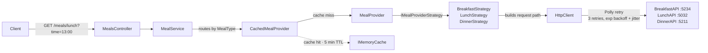

# FoodMaker API

## Overview

FoodMaker is a .NET 10 aggregation API that returns meal ingredients for breakfast, lunch and dinner by querying three independent provider APIs. Each provider has its own contract, serving hours and response format; FoodMaker normalises them behind a single `GET /meals/{mealType}` endpoint. Responses are cached in-memory and outbound calls are protected by a Polly retry pipeline with exponential backoff.

## Architecture

The request flows through a layered pipeline: the controller parses and validates input, delegates to `MealService` which routes by `MealType`, and the selected `IMealProvider` calls the external API through an `HttpClient` configured with retry policies. Each provider is composed at startup as `CachedMealProvider` (decorator) wrapping `MealProvider`, which delegates protocol-specific concerns (URL building, response mapping, 400-status semantics) to an `IMealProviderStrategy` implementation.



## How to Run

Start all four services (three providers + the aggregator):

```bash
dotnet run --project BreakfastAPI &
dotnet run --project LunchAPI &
dotnet run --project DinnerAPI &
dotnet run --project FoodMaker
```

| Service       | HTTP Port |
|---------------|-----------|
| FoodMaker     | 5221      |
| BreakfastAPI  | 5234      |
| LunchAPI      | 5032      |
| DinnerAPI     | 5211      |

Example request:

```bash
curl http://localhost:5221/meals/lunch?time=13:00
# ["soup","potatoes","salad"]
```

Run tests:

```bash
dotnet test
```

## Design Decisions

- **Strategy pattern for providers** -- each external API has a different contract (query string vs path segment, different JSON shapes); strategies encapsulate these differences without conditional logic in the provider.
- **Decorator-based caching** -- `CachedMealProvider` wraps `MealProvider` transparently, keeping cache logic out of HTTP logic and making it easy to disable or swap.
- **Only successful results are cached** -- failures are transient by nature; caching them would mask recovery.
- **Result type instead of exceptions** -- `ProviderResult` carries either ingredients or a typed `ProviderError`, avoiding exception-driven control flow.
- **`TreatBadRequestAsMealNotServed` flag** -- Lunch and Dinner APIs return 400 for out-of-range hours (a domain concept), while Breakfast returns an empty collection; the flag lets each strategy declare the semantics without branching in shared code.
- **Polly retry with jitter** -- exponential backoff (2^n seconds) plus random jitter avoids thundering-herd retries against struggling providers.
- **Scoped `MealService`, singleton providers** -- the service is lightweight and request-scoped; providers hold no request state and share the cache safely.

## Testing Strategy

Tests follow the testing pyramid: a broad base of unit tests covering each component in isolation, with integration tests at the top verifying DI wiring and end-to-end HTTP behaviour.

- **~35 unit tests** -- `MealServiceTests`, `BreakfastProviderTests`, `LunchProviderTests`, `DinnerProviderTests`, `CachedMealProviderTests`, `MealTypeParserTests`. HTTP calls are faked via mock `HttpMessageHandler`; provider dependencies use NSubstitute.
- **~13 integration tests** -- `ServiceRegistrationTests` (DI container verification) and `MealsEndpointTests` (full request pipeline via `WebApplicationFactory`).
- **Intentionally not tested:** Polly retry behaviour (tested by the library), the three stub provider APIs (trivial minimal APIs with no domain logic), and `Program.cs` startup beyond what integration tests cover.

## What I'd Add for Production

- **Redis-backed `IDistributedCache`** -- replace in-memory cache for horizontal scaling.
- **OpenTelemetry tracing** -- with correlation IDs propagated downstream via `traceparent` headers.
- **`/health` endpoint** -- with provider connectivity checks via `IHealthCheck`.
- **Circuit breaker** -- Polly `CircuitBreakerAsync` to fail fast when a provider is persistently down.
- **Structured logging sink** -- Serilog or OpenTelemetry Logs exporting to a central store.
- **Secrets via Azure Key Vault** -- provider URLs and any future API keys out of `appsettings.json`.
- **Container images** -- multi-stage Dockerfile per service, orchestrated with Docker Compose.
- **GitHub Actions deployment** -- CI pipeline with build, test, image push, and environment promotion.

## Extending: Adding a New Provider

1. Create a new `IMealProviderStrategy` implementation (define `MealType`, `ProviderName`, `BuildRequestPath`, `MapResponse`, and `TreatBadRequestAsMealNotServed`).
2. Add response DTOs in `Providers/Responses/` matching the external API's JSON contract.
3. Add the new `MealType` enum value.
4. Add the provider's base URL to `appsettings.json` under `Providers`.
5. Add the strategy to the `strategies` array in `ServiceCollectionExtensions.AddMealProviders` -- registration, HTTP client, caching, and retry are automatic.

## AI Usage

See [AI-USAGE.md](AI-USAGE.md) for details on AI tool usage during development.
